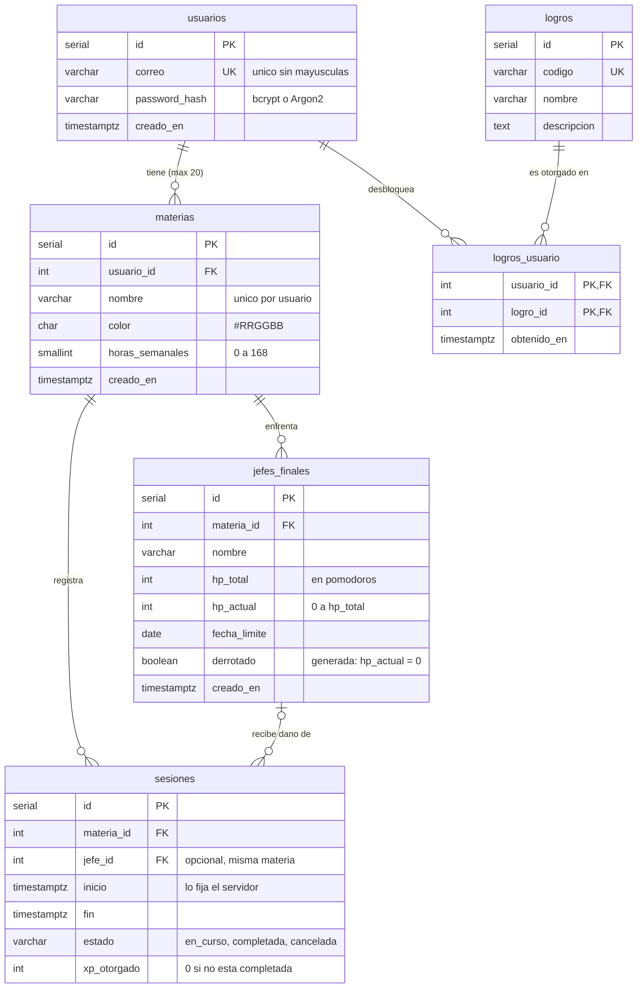

# Modelo de datos — PomoPet

Esquema en `database/init/01_schema.sql` (PostgreSQL 16).
Issue relacionado: #1 · Requerimientos: RF-02, RF-11, RF-12, RNF-03, RNF-05

## Diagrama entidad-relación



## Reglas que garantiza la base de datos

| Regla                                             | Cómo se implementa                                 | Req.   |
| ------------------------------------------------- | -------------------------------------------------- | ------ |
| Máximo 20 materias por usuario                    | Trigger `materias_tope_20`                         | RF-02  |
| Contraseña nunca en texto plano                   | Solo existe la columna `password_hash`             | RNF-05 |
| Correo único sin importar mayúsculas              | Índice único sobre `LOWER(correo)`                 | RF-13  |
| Sesión cancelada no da XP                         | `CHECK (estado = 'completada' OR xp_otorgado = 0)` | RF-11  |
| Una sesión en curso no tiene `fin`                | `CHECK ((estado = 'en_curso') = (fin IS NULL))`    | RF-01  |
| El Jefe pertenece a la misma materia de la sesión | Llave foránea compuesta `(jefe_id, materia_id)`    | RF-06  |
| El Jefe queda derrotado al llegar a HP 0          | Columna generada `derrotado`                       | RF-12  |
| Un logro se obtiene una sola vez por usuario      | Llave primaria `(usuario_id, logro_id)`            | —      |

## XP y progreso

El XP **no se guarda en `materias`**: se calcula sumando `sesiones.xp_otorgado`
con la vista `v_progreso_materia`, para que exista una sola fuente de verdad.

```sql
SELECT * FROM v_progreso_materia WHERE usuario_id = 1;
```

Devuelve por materia: `xp_total`, `pomodoros_completados`,
`pomodoros_cancelados` y `minutos_estudiados`.

## Si cambia el esquema

PostgreSQL solo ejecuta `database/init/` cuando el volumen está vacío.
Después de traer cambios del esquema hay que recrearlo (**borra los datos locales**):

```bash
docker compose down -v
docker compose up --build
```
