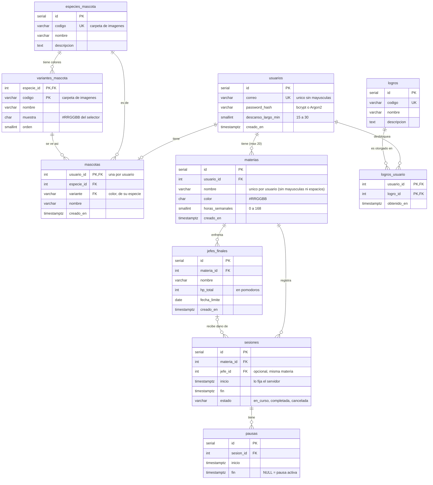

# Modelo de datos — PomoPet

Esquema en `database/init/01_schema.sql` (PostgreSQL 16).
Datos iniciales: `02_logros.sql` (logros), `03_especies.sql` (especies de mascota) y `04_variantes.sql` (colores; se genera con `npm run sprites:variantes`, no se edita a mano).
Issue relacionado: #1 · Requerimientos: RF-01, RF-02, RF-06, RF-09, RF-10, RF-11, RF-12, RNF-03, RNF-05

## Diagrama entidad-relación



## Reglas que garantiza la base de datos

| Regla                                             | Cómo se implementa                                     | Req.   |
| ------------------------------------------------- | ------------------------------------------------------ | ------ |
| Máximo 20 materias por usuario                    | Trigger `materias_tope_20` (en `INSERT` y `UPDATE`)    | RF-02  |
| Materia única por usuario                         | Índice único sobre `(usuario_id, LOWER(TRIM(nombre)))` | RF-02  |
| Contraseña nunca en texto plano                   | Solo existe la columna `password_hash`                 | RNF-05 |
| Correo único sin importar mayúsculas              | Índice único sobre `LOWER(correo)`                     | RF-13  |
| Descanso largo entre 15 y 30 minutos              | `CHECK` en `usuarios.descanso_largo_min`               | RF-10  |
| Una mascota por usuario                           | Llave primaria `mascotas.usuario_id`                   | —      |
| No se borra una especie que alguien usa           | Llave foránea sin `CASCADE`                            | RNF-03 |
| El color de la mascota es de su especie           | Llave foránea compuesta `(especie_id, variante)`       | —      |
| Una sesión en curso no tiene `fin`                | `CHECK ((estado = 'en_curso') = (fin IS NULL))`        | RF-01  |
| Solo una pausa abierta por sesión                 | Índice único parcial `pausas_una_abierta`              | RF-01  |
| El Jefe pertenece a la misma materia de la sesión | Llave foránea compuesta `(jefe_id, materia_id)`        | RF-06  |
| Solo las sesiones completadas dañan al Jefe       | Vista `v_estado_jefe`                                  | RF-12  |
| Un logro se obtiene una sola vez por usuario      | Llave primaria `(usuario_id, logro_id)`                | —      |
| Nombres (materia, jefe, mascota) no vacíos        | `CHECK (length(trim(nombre)) > 0)`                     | —      |

## Datos calculados (no se guardan)

Para cumplir la **tercera forma normal (3FN)**, nada que se pueda calcular se guarda
en una tabla. Así existe una sola fuente de verdad y no hay datos que se desincronicen.

| Dato                             | Dónde se calcula                                                |
| -------------------------------- | --------------------------------------------------------------- |
| Pomodoros y minutos por materia  | Vista `v_progreso_materia` (resta el tiempo en `pausas`)        |
| HP actual y "derrotado" del Jefe | Vista `v_estado_jefe` (`hp_total` − pomodoros completados)      |
| XP por materia (100 × pomodoro)  | Backend (Python), con `pomodoros_completados` — RF-03           |
| Rango de dominio                 | Backend (Python), a partir del XP — RF-04                       |
| Etapa de evolución de la mascota | Backend (Python), a partir del XP total del usuario             |
| Estado de la mascota             | Según la sesión actual (estudiando, éxito, cancelado, descanso) |

```sql
SELECT * FROM v_progreso_materia WHERE usuario_id = 1;
SELECT * FROM v_estado_jefe      WHERE materia_id = 3;
```

**Desnormalización aceptada:** `sesiones` guarda `materia_id` y también `jefe_id`, aunque el
jefe ya determina la materia. Se deja así porque el jefe es opcional (una sesión puede no
atacar a ningún jefe) y la llave foránea compuesta impide que ambos datos se contradigan.

## Responsabilidades del backend

La base de datos no puede validar todo. El backend debe:

- Crear el usuario y su mascota en la **misma transacción** al registrarse.
- Cerrar la pausa abierta (poner `fin`) antes de completar o cancelar una sesión.
- Marcar una sesión como `completada` solo si pasaron 25 minutos **sin contar las pausas** (RF-09).

## Pruebas

`database/tests/pruebas_reglas.sql` prueba las 20 reglas dentro de una transacción que se
deshace al final (no deja datos):

```bash
docker compose cp database/tests/pruebas_reglas.sql db:/tmp/pruebas.sql
docker compose exec db sh -c 'psql -U "$POSTGRES_USER" -d "$POSTGRES_DB" -f /tmp/pruebas.sql'
```

## Si cambia el esquema

PostgreSQL solo ejecuta `database/init/` cuando el volumen está vacío.
Después de traer cambios del esquema hay que recrearlo (**borra los datos locales**):

```bash
docker compose down -v
docker compose up --build
```
